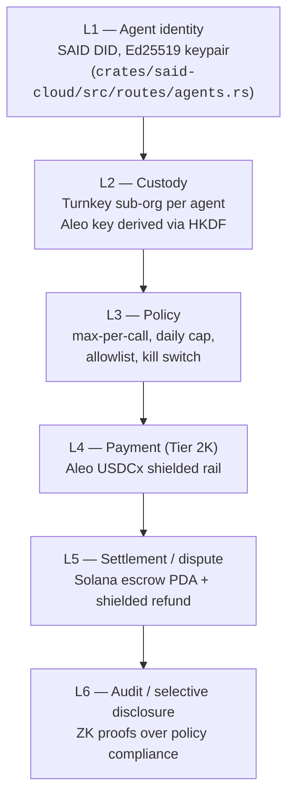

# Shielded Agent Finance — Architecture

Status: design document. The payment-leg deep doc
([tier-2k-shielded-payments.md](./tier-2k-shielded-payments.md)) and
the build-state inventory
([shielded-build-state.md](./shielded-build-state.md)) ship alongside
it. Owner: identity + payments + privacy. Tone and depth match
[cryptographic-primitives.md](./cryptographic-primitives.md).

This document specifies the architecture for **shielded agent
finance**: the identity, custody, policy, payment, settlement, and
audit layers that together let a Ghola-issued agent transact on
behalf of a user without leaking either party's identity or
violating the user's spending policy.

## 0. Scope and relationship to Tier 2K

Tier 2K — Shielded Payment Rail — is the payment leg of this stack.
It closes the *public ledger leak* (the bipartite payer→provider
graph inherent to public Solana settlement) by routing settlement
through Aleo's shielded record model. Tier 2K is one of six layers
this document covers; it is necessary, not sufficient.

This doc is broader. It spans:

| Layer | Concern | Where it lives in this doc | Where to read deeper |
|---|---|---|---|
| L1 | Agent identity | §2.1, §3 step 1 | `crates/said-cloud/src/routes/agents.rs`; `project_ghola_headless_merchant.md` |
| L2 | Custody | §2.2, §3 steps 2-3 | `crates/said-turnkey/src/turnkey.rs`; `project_ghola_turnkey_integration.md` |
| L3 | Policy | §2.3, §3 step 4 | Turnkey policy engine (memory-only, not in this repo) |
| L4 | Payment | §2.4 (reference only) | [tier-2k-shielded-payments.md](./tier-2k-shielded-payments.md) |
| L5 | Settlement / dispute | §2.5 | Escrow PDA design (forward-looking) |
| L6 | Audit / selective disclosure | §2.6, §4 | `crates/ghola-cloud/src/services/private_settlement_service.rs` |

Tier 2K is the **fourth** of those six. The other five are layered
around it and constrain its design: L1 decides who is allowed to ask
for a shielded payment, L2 holds the keys that sign it, L3 decides
whether the request is permitted, L5 owns refunds, and L6 makes the
whole thing auditable without breaking unlinkability.

A reader who only cares about payment unlinkability — the page-one
threat — should still read Tier 2K first. A reader who wants to
understand why Ghola is a credible *agent finance* substrate (not
"shielded USDC for fun") should read this doc.

### Decisions still owed (scope)

- Whether the dispute / arbitration layer (L5) lives on Solana
  (escrow PDA) or on Aleo (private escrow record). Current lean:
  Solana PDA, because reputation attestations are already there
  (`project_ghola_headless_merchant.md`), and the arbiter set must
  be public.
- Whether agent-DID issuance lives in `programs/said-registry` or in
  a separate `programs/agent-registry`. Current lean: same program,
  separate seed prefix.

## 1. Threat model

The threat model extends Tier 2K §1 (payment-graph unlinkability)
with five additional properties.

### 1.1 Agent identity unlinkability

A user spawns *N* agents over time. An external observer (anyone
who can read the public registry, attestation set, or settlement
chain) should not be able to determine which agents belong to the
same owner. The "owner" relation must be hidden by default.

The current public registry posture (per
`project_ghola_headless_merchant.md`) is to publish a
`ServiceRecord` PDA per agent, attesting that the agent is who it
says it is. That alone leaks the owner-agent edge if the PDA is
keyed by the owner's Solana pubkey. The defence is: PDA keyed by a
fresh derived child key per agent, with the owner-agent link held
only inside Turnkey's sub-org structure (L2) and never written
on-chain.

### 1.2 Agent-owner unlinkability

Stronger than 1.1: even an actor who compromises a *single* agent's
key should not learn the owner's identity, nor the other agents the
same owner controls. This is forward + backward secrecy for the
owner relation.

Achievable because Turnkey root-quorum holds the parent →
sub-orgs mapping and the sub-org's keys are scoped (`per
Turnkey-integration plan`, "Daily spending limits stay
server-side... Per-tx limits and recipient whitelists enforced at
Turnkey enclave level"). A leaked sub-org API key gives the
attacker the agent's signing surface, **but not the parent org id,
not the sibling sub-orgs, and not the owner's identity**, as long
as the sub-org's view of the parent is opaque.

### 1.3 Policy enforcement against rogue agents

The owner attaches a spending policy at agent creation: max-per-call,
daily cap, merchant allowlist, time windows, kill switch. A
compromised agent (prompt injection, RCE, or hostile counterparty)
must not be able to exceed the policy regardless of what code the
agent runs locally.

The defence is **enclave-side policy enforcement**, not client-side:
the policy is uploaded to Turnkey as a `DENY` policy attached to the
agent's sub-org. Turnkey refuses to sign any transaction that
violates the policy, no matter what the client asks. Client-side
enforcement is advisory only.

### 1.4 Audit without deanonymisation

A regulator, the owner, or a delegated auditor sometimes needs
proof that the agent stayed within policy — for tax, compliance, or
trust purposes. That proof should not require re-revealing the
agent's transaction history.

The defence is selective-disclosure ZK proofs: the user (or the
auditor, with the user's consent) gets a proof of the predicate
"agent A spent ≤ $X on category Y between t₀ and t₁" without the
proof revealing any individual settlement. See §4.

### 1.5 Adversary capabilities

Inherits the Tier 2K table (passive chain observer, active provider
operator, active correlator, cluster analyst), plus:

| Adversary | Capability | What they learn today |
|---|---|---|
| **Rogue agent** | Operates inside one of the user's agents; can issue any local API call. | Whatever the *agent's own scope* permits — bounded by the Turnkey policy if enforced enclave-side, unbounded if enforced only in client code. |
| **Compromised provider auditor** | A counterparty asks the user to prove "the agent that paid me was authorised." | Can demand a proof; should not get the agent's full history. |
| **Subpoena holder** | A government compels the user to produce records. | Should get the selectively disclosed predicate, **not** the unredacted ledger. |

### 1.6 What we explicitly do not protect

- **Owner-key compromise.** If the owner's Turnkey root quorum is
  compromised, the attacker can mint new agents, alter policies,
  and exfiltrate. The mitigation is multi-signer root quorum at the
  Turnkey level (a Ghola-platform constant) and out-of-band recovery
  (`project_ghola_turnkey_integration.md`, "Multi-sig escrow uses
  Turnkey root quorum").
- **Coerced selective disclosure.** A user under coercion can
  disclose their own proofs. We can't help. Plausible-deniability
  modes (multiple agents, disposable agents) are an orthogonal
  hardening direction; they are out of scope for v1.
- **Bridge operator deanonymisation.** Inherits Tier 2K §5; the
  fix lives in §5 below (top-up batching + cover traffic).

## 2. Architecture overview

Six layers, each with one responsibility. The same diagram, twice —
once as text, once as mermaid, because everyone has different
tooling.

```
+---------------------------------------------------------------+
|  L6  Audit / Selective Disclosure                              |
|      ZK proofs over policy + spending history                  |
|      Consumers: owner, compliance, third-party auditor         |
+---------------------------------------------------------------+
                              ^
                              |
+---------------------------------------------------------------+
|  L5  Settlement / Dispute                                      |
|      Escrow PDA + shielded refund path                         |
|      Arbiter set chosen by reputation                          |
+---------------------------------------------------------------+
                              ^
                              |
+---------------------------------------------------------------+
|  L4  Payment        ← Tier 2K (deep doc)                       |
|      Aleo shielded rail (X402SettlementProof::AleoShielded)    |
|      USDCx records, transition + nullifier + proof             |
+---------------------------------------------------------------+
                              ^
                              |
+---------------------------------------------------------------+
|  L3  Policy                                                    |
|      Turnkey policy engine: max-per-call, daily cap,           |
|      merchant allowlist, time windows, kill switch             |
|      Enforced at the enclave; client-side is advisory          |
+---------------------------------------------------------------+
                              ^
                              |
+---------------------------------------------------------------+
|  L2  Custody                                                   |
|      Turnkey sub-org per agent                                 |
|      Aleo signing key = HKDF-SHA256(Turnkey_sig, label)        |
+---------------------------------------------------------------+
                              ^
                              |
+---------------------------------------------------------------+
|  L1  Agent identity                                            |
|      DID via SAID, Ed25519 keypair from creation               |
|      Agent sub-org under owner's Turnkey root quorum            |
+---------------------------------------------------------------+
```



### 2.1 L1 — Agent identity (already shipped)

Each agent has its own Ed25519 keypair → DID + Solana receive
address from creation, per the headless-merchant work
(`crates/said-cloud/src/routes/agents.rs:266-267`, the `agent_wallets`
table). The DID is published in the SAID registry; the Solana
address is the default `receive_address` for inbound payments.

The owner-agent edge is **not** published on-chain. The agent's PDA
in the registry carries reputation, capabilities, and an Aleo
address (per the future state of `programs/ghola-model-registry`,
Layer 4 in [shielded-build-state.md](./shielded-build-state.md)) —
but not an owner pubkey.

Open question: today's `agent_wallets.user_id` column links agent to
owner in the *server-side* DB. For agent-owner unlinkability against
a server compromise we would need that link encrypted under the
owner's vault key, decryptable only by the owner. Today it is a
plain FK. We accept that trade for v1 (compromise of Ghola's DB
reveals the agent-owner graph) and revisit in v2.

### 2.2 L2 — Custody (partly shipped, mostly stub)

For each agent at creation time, Ghola provisions a Turnkey sub-org
under the owner's root quorum. The sub-org holds two keys:

- A Solana signing key (already provisioned in v1 — but currently
  identity-only, not custodial; the private key is not stored, per
  the headless-merchant memory: "v1 is identity + receive-only;
  sending requires future custodial signing or Turnkey").
- An Aleo signing key derived deterministically per Tier 2K §4.3:

  ```
  challenge   = sha512("ghola-agent-aleo-account-v1" || agent_did)
  signature   = Turnkey.sign_ed25519(agent_suborg_root_user, challenge)
  aleo_seed   = sha256(signature)
  aleo_priv   = Aleo.account_from_seed(aleo_seed)  // BLS12-377
  ```

  The seed never leaves Turnkey's enclave. The signature is
  reproducible (deterministic Ed25519), so the agent's Aleo address
  is recoverable from `(agent_did, turnkey_suborg_root_user)`
  alone — no extra state is needed on the client.

The credential vault adapter (`crates/said-turnkey/src/turnkey.rs`)
is the in-tree Turnkey surface today. It handles DEK wrap/unwrap for
merchant credentials, not sub-org provisioning. `mint_suborg` is
explicitly stubbed:

> `mint_suborg` is still stubbed — out of scope for v2.
> (`crates/said-turnkey/src/turnkey.rs:7-9`)

Per `project_ghola_turnkey_integration.md`, a full Turnkey integration
(pre-gen wallets, policies, sessions, delegated agents, export,
multi-sig escrow, audit trail) was implemented in the **old** said
repo's `crates/said-cloud/src/routes/turnkey.rs`. Whether that code
lives in the consolidated ghola monorepo today is, per
[shielded-build-state.md](./shielded-build-state.md) §Layer 10,
**missing**. Bringing it forward into the consolidated repo is a
prerequisite to this layer.

### 2.3 L3 — Policy (not shipped)

Policies are uploaded to Turnkey as DENY rules attached to the
agent's sub-org. Five policy primitives in v1:

- **max-per-call** — single-transaction USDC cap.
- **daily cap** — cumulative USDC across all txs in a rolling 24 h
  window. Per the Turnkey-integration plan, "Daily spending limits
  stay server-side (Turnkey can't do time-windowed policies)" —
  meaning the *enforcement* is split: Turnkey blocks any tx larger
  than the per-call cap, and Ghola's server checks the daily cap
  before requesting a signature. A user who runs their own
  Turnkey-quorum signer (Phase 2) loses the daily cap until Turnkey
  ships time-windowed policies.
- **merchant allowlist** — recipient address whitelist, enforced
  enclave-side.
- **time windows** — optional active hours (e.g. "no payments
  between 02:00–06:00 owner-local"). Same split as daily caps:
  Turnkey can't do this natively; Ghola server gates the signature
  request.
- **kill switch** — the owner can flip a single boolean and revoke
  all delegated-agent API keys for the sub-org. Per the Turnkey
  integration: "Delegated agents: ... emergency freeze."

Policy hash is the canonical SHA-256 of `(version, max_per_call,
daily_cap, allowlist, time_window, kill_switch)`. It is bound into
each signer attestation (already enforced in the user-held shielded
flow at
`crates/ghola-cloud/src/services/private_settlement_service.rs:379-393`),
so a tampered policy invalidates the receipt.

### Decisions still owed (L3)

- Where the policy hash is anchored. Options: (a) write it into the
  agent's PDA in the registry (public; anyone can verify the agent's
  policy matches the receipt); (b) keep it only in Turnkey + Ghola
  DB (private; verifiers must trust Ghola to attest the hash). Lean
  (a) for v1 — the policy is non-identifying.
- Whether the owner can change the policy after agent creation. v1:
  yes, with a fresh policy hash → new agent identity (forces
  honest disclosure). v2: maybe in-place edit with a policy-version
  field on the PDA.

### 2.4 L4 — Payment (Tier 2K)

This layer is specified in
[tier-2k-shielded-payments.md](./tier-2k-shielded-payments.md).
Summary only:

- Settlement on Aleo, asset USDCx, recipient address on Aleo.
- Wire schema: `X402SettlementProof::AleoShielded { proof_b64,
  nullifier_hex, epoch }` (`crates/said-x402/src/settlement.rs:47-51`).
- Verification: signed-receipt envelope from the Aleo verifier
  adapter (`apps/web/src/app/api/aleo-shielded/verify/route.ts`,
  `crates/ghola-cloud/src/services/x402_service.rs:1399-1515`).
- Bridge: USDC (Solana) → USDC.a (Aleo) via a single bridge,
  refilled out-of-band. Not yet implemented (Layer 8 in
  [shielded-build-state.md](./shielded-build-state.md)).

### 2.5 L5 — Settlement / dispute (not shipped)

Two failure modes need a refund path:

- The provider failed to deliver (inference enclave dropped the
  request, returned a malformed response, never signed a receipt).
- The agent paid the wrong provider (registry lookup poisoned, or
  the agent followed an injection attack).

Design:

- The agent pays into an **escrow PDA on Solana** rather than the
  provider's pubkey directly, for v1 high-value transactions.
- The escrow PDA is 2-of-3 (agent, provider, platform arbiter), per
  the existing multi-sig escrow design
  (`project_ghola_turnkey_integration.md`, "Multi-sig escrow uses
  Turnkey root quorum (not on-chain multi-sig)"). v2 may move this
  to on-chain Solana multi-sig if the Turnkey root-quorum surface
  proves a bottleneck.
- For routine low-value paid-inference calls (sub-cent), escrow is
  skipped — the payment lands at the provider directly and a
  failure refunds via the provider's own credit balance (already
  present in `x402_payments.settled`).
- Shielded refund path: the agent's Aleo key signs a "refund
  request" transition. The provider executes a counter-transition
  that produces a refund record owned by the agent. Both
  transitions are shielded; the public chain sees only a refund
  nullifier.

### Decisions still owed (L5)

- Arbiter set composition. Reputation-weighted selection (the
  existing 5-component score in
  `project_ghola_headless_merchant.md`) versus a fixed
  ghola-platform arbiter. v1: ghola-platform arbiter, explicit
  about the trust assumption. v2: reputation-weighted.
- Whether dispute initiation reveals the payer's identity to the
  arbiter. v1: yes (the arbiter sees the agent's DID). The
  privacy claim is *passive observer* unlinkability, not arbiter
  unlinkability.

### 2.6 L6 — Audit / selective disclosure

Today's "selective disclosure" is hashed-metadata export
(`crates/ghola-cloud/src/services/private_settlement_service.rs:1039-1108`).
It is not a ZK proof — it is a redacted JSON dump. The audit layer
this document specifies replaces that with one of two predicate
proofs at v1 (see §4):

- **Spending-cap proof.** "Agent A spent ≤ $X total in window
  [t₀, t₁]." Reveals the bound, the window, and the agent DID;
  reveals nothing else.
- **Allowlist proof.** "Every settlement Agent A made in window
  [t₀, t₁] was to a recipient in set S." Reveals the agent DID and
  the recipient set membership predicate; reveals nothing else.

These are pre-computed by the user (or their auditor with consent)
over their own settlement records and the policy hash.

## 3. Agent-as-payer flow

Concrete sequence for a single paid inference call. Numbers
correspond to the layers above.

```
1. Owner spawns an agent:
   POST /v1/agents { name: "research-bot", policy: {...} }
   Ghola:
     - mints agent_id, agent_did, Ed25519 + Solana receive addr  (L1)
     - calls Turnkey: create sub-org under owner root quorum     (L2)
     - uploads policy as Turnkey DENY rules                      (L3)
     - derives agent's Aleo address (L2 §2.2)
     - publishes ServiceRecord PDA with policy_hash + aleo_addr  (L3)

2. Agent boots, requests inference:
   POST https://provider.example/v1/chat/completions
   Provider returns 402 with payment options including
   { rail: "aleo_usdcx_shielded", price_micro_usdc: 2400,
     recipient: <provider_aleo_addr>, model: ghola_pay.aleo }

3. Agent (running locally) requests a signature from Ghola:
   POST ghola-cloud /v1/agents/{agent_id}/pay
     { rail: "aleo_usdcx_shielded", amount: 2400,
       recipient: <provider_aleo_addr>, intent_id: ... }

   ghola-cloud:
     a. checks daily-cap policy (server-side, time-windowed)     (L3)
     b. constructs the Aleo transition payload
     c. asks Turnkey to sign with the agent sub-org's Aleo key   (L2)
        Turnkey enclave checks per-tx cap + allowlist
     d. if denied: returns 4xx with policy-violation reason
     e. if approved: signature is sealed inside a signer
        attestation bound to (intent_id, policy_hash,
        proof_digest, receipt_ref)                               (L3, L4)

4. Agent submits the proof to provider:
   POST https://provider.example/v1/chat/completions
     headers: x402-Payment = base64({ kind: "aleo_shielded",
                              proof_b64, nullifier_hex, epoch }) (L4)

5. Provider verifies via the Aleo adapter:
   POST /api/aleo-shielded/verify  ->  signed receipt            (L4)

6. Provider runs inference, returns response with receipt body
   (settlement_rail = "shielded_stablecoin"; per
   shielded-build-state.md §Layer 9, this field is in-memory only
   today — not yet on the canonical anchored body).

7. Optional later: owner exports a ZK proof of policy compliance
   over the window covering this call                            (L6)
```

The two policy enforcement points in step 3:

- `3a` (server-side, in Ghola): time-windowed daily cap + active-
  hours. Ghola refuses to request a signature.
- `3c` (enclave-side, in Turnkey): per-tx cap, allowlist, kill
  switch. Turnkey refuses to sign even if Ghola asks. The
  enclave-side check is the *unbypassable* policy boundary; the
  server-side check is the cheap-to-evaluate first gate.

A request that passes (3a) but fails (3c) is the canonical "Ghola
server compromise" failure mode: the attacker can ask, but cannot
sign.

## 4. Selective disclosure

### 4.1 What we support at v1

Two proof families:

**Spending-cap proof** (predicate: `total ≤ X`)

- Public inputs: agent DID, window `[t₀, t₁]`, bound `X`, policy hash.
- Private inputs: every shielded transfer the agent made in
  `[t₀, t₁]` (amount, recipient, timestamp).
- Statement proven: the sum of amounts over the private set is
  ≤ `X`, and every transfer carries a signer attestation binding
  it to the agent's signing key, and the policy hash matches.

**Allowlist proof** (predicate: `recipients ⊆ S`)

- Public inputs: agent DID, window `[t₀, t₁]`, allowlist Merkle
  root `S_root`, policy hash.
- Private inputs: same set of transfers.
- Statement proven: every recipient appears as a leaf under `S_root`,
  every transfer is signer-attested for the agent.

### 4.2 Proof system

**Halo2 (KZG flavour).** Justified:

- Mature recursive composition (we may want to compose
  spending-cap × allowlist as a single proof later).
- No trusted setup with the KZG variant on a transparent setup
  (using a reused universal SRS); operationally tractable.
- Wide tooling: `halo2_proofs`, `halo2_gadgets`, Axiom's circuits;
  Privacy & Scaling Explorations is the maintainer.
- Circuits compile to constraint counts on the order of `2^16`–`2^18`
  for our predicates (we estimate ~50 transfers per audit window
  × ~30 constraints per range proof + Merkle membership), which is
  desktop-prover-friendly (~10 s on an M-series laptop).

Considered and rejected:

- **Plonky2.** Faster prover, but FRI-based proofs are larger
  (~100 KB vs Halo2's ~5 KB). For audit proofs that get *shared*
  with regulators / counterparties, proof size dominates. Reject.
- **Groth16.** Smallest proofs, but circuit-specific trusted setup
  per predicate. Operationally painful for any predicate we want
  to iterate on. Reject.
- **Bulletproofs.** Range proofs only; no membership. Insufficient
  for the allowlist case. Reject.

### Decisions still owed (4.2)

- Whether we batch agents (one proof covers a *set* of agents owned
  by the same owner). v1: no — the owner produces N proofs for N
  agents. v2: combine into a single recursive proof when we want
  the "this whole owner stayed under cap X" predicate.
- Circuit upgrade path. Halo2 circuits are not portable; a
  predicate change requires a new circuit + reproof. We commit to
  versioning the predicate (e.g. `v1.spending_cap`,
  `v1.allowlist`) and freezing each version.

### 4.3 Consumers

- **Compliance.** A regulator demands proof an agent stayed within
  declared limits. The owner generates a spending-cap proof; the
  regulator verifies it against the on-chain policy hash and
  agent DID. No raw transactions move.
- **Owner self-audit.** The owner reviews their own agents' spend
  without re-pulling settlement history. Same proof, internal use.
- **Counterparty / arbiter.** During a dispute (L5), the arbiter
  demands proof the disputed payment was within policy. The owner
  produces an allowlist proof that covers the dispute window.

In all three cases the verifier needs only the public inputs +
proof + the public verification key for the circuit. No Ghola
backend access is required (verifier is a thin
Halo2-verifier shipped as a wasm bundle on `/r/[hash]`'s sibling
page, by analogy with the existing receipt verifier in
`cryptographic-primitives.md` §"Receipt signing").

## 5. Migration & build order

Four phases, keyed to Tier 2K §6 and to the build-state inventory.

### Phase 0 — Adapter live, agents excluded

(**Where we are now.**)

- Tier 2K's signed adapter boundary is shipped (L4 verification).
- User-held shielded transfers work via the private-settlement
  service (L3-lite, user not agent).
- L1 agents exist as identities but cannot pay.

Exit criteria: institutional readiness flag flips true (already
gated, see
`crates/ghola-cloud/src/services/private_settlement_service.rs:1188-1253`).

### Phase 1 — Agent-as-payer on public rail

Goal: agents can pay providers on Solana public USDC, with Turnkey
policy enforcement.

Depends on:

- Bringing the Turnkey deep-integration code (sub-org per agent,
  policy engine, sessions, delegated agents, kill switch) into the
  consolidated ghola monorepo. Today it lives only in the old said
  repo per `project_ghola_turnkey_integration.md`.
- Implementing `mint_suborg` properly in
  `crates/said-turnkey/src/turnkey.rs` (today stubbed).
- Wiring Turnkey-signed Solana transfers into a per-agent
  payment endpoint (POST `/v1/agents/{id}/pay`).
- Anchoring the policy hash on the agent's PDA in
  `programs/ghola-model-registry` or a new
  `programs/agent-registry` (L3 decision still owed).

Exit criteria: a registered agent can complete an x402 paid
inference call on Solana public USDC with the per-tx cap enforced
by Turnkey.

### Phase 2 — Agent-as-payer on shielded rail

Goal: agents can pay providers on Aleo USDCx with policy
enforcement.

Depends on **everything in Phase 1**, plus:

- Aleo signing key derived per agent (L2 §2.2).
- `crates/said-shielded` crate that builds, signs, and broadcasts
  Aleo transitions on behalf of an agent. Currently missing
  ([shielded-build-state.md](./shielded-build-state.md) §Layer 5).
- `ghola_pay.aleo` Leo program in-tree
  ([shielded-build-state.md](./shielded-build-state.md) §Layer 6).
- Registry `aleo_address` + `price_micro_usdc_shielded` fields
  fully declared on `ModelRecord` (today partial — handlers
  reference them, struct does not declare them; see
  [shielded-build-state.md](./shielded-build-state.md) §Layer 4).
- Bridge integration (USDC → USDC.a), at minimum for owner-level
  top-ups. Currently missing
  ([shielded-build-state.md](./shielded-build-state.md) §Layer 8).
- `apps/web/src/lib/shielded-payment.ts` (TS client). Currently
  missing ([shielded-build-state.md](./shielded-build-state.md)
  §Layer 7).
- `settlement_rail` field on the canonical anchored receipt body.
  Currently missing
  ([shielded-build-state.md](./shielded-build-state.md) §Layer 9).

Exit criteria: a registered agent can complete an x402 paid
inference call on Aleo USDCx with all five Tier 2K verification
gates green and `institutional_readiness.ready=true` for
agent-rail readiness specifically (new field).

### Phase 3 — Escrow + dispute (L5)

Goal: high-value agent payments route through escrow with a refund
path.

Depends on Phase 2. Additional work:

- Solana escrow PDA program (new under `programs/`).
- Refund-side Aleo transition in `ghola_pay.aleo`.
- Arbiter selection logic (v1: ghola-platform arbiter).

### Phase 4 — Audit / selective disclosure (L6)

Goal: ZK proofs of policy compliance.

Depends on Phase 2 (we need real shielded settlement records to
prove over). Independent of Phase 3 (you can prove compliance even
on calls that didn't escrow).

Work:

- Halo2 circuits for spending-cap + allowlist predicates.
- Prover wrapper crate (wasm + native Rust).
- Verifier wasm shipped under `/r/`.
- Replace the metadata-only "selective disclosure export"
  (`crates/ghola-cloud/src/services/private_settlement_service.rs:1039-1108`)
  with a real ZK-proof-emitting endpoint.

## 6. Engineering estimate

Honest, calendar-week format (1 wall-clock week = ~60 % focus
allocation, so 1 wall-clock wk ≈ 25 focused engineer-hours).

| Layer / phase | Wall-clock |
|---|---|
| **Phase 1 — agent on public rail** | |
| Turnkey deep integration (port from old repo, wire to consolidated monorepo) | 4 wk |
| `mint_suborg` real implementation + tests | 2 wk |
| Agent-pay endpoint + Turnkey signing of Solana transfers | 2 wk |
| Policy hash anchored on agent PDA + program migration | 1.5 wk |
| **Phase 1 subtotal** | **9.5 wk** |
| **Phase 2 — agent on shielded rail** | |
| `crates/said-shielded` (account derivation, transition builder, broadcaster) | 3 wk |
| `apps/web/src/lib/shielded-payment.ts` (TS mirror + top-up modal) | 2.5 wk |
| `ghola_pay.aleo` Leo program (in-tree source, deploy, IDL pin) | 1 wk |
| `programs/ghola-model-registry` realloc + fully declare the partial fields | 1.5 wk |
| Bridge integration (Wormhole NTT or equivalent) | 3 wk |
| `settlement_rail` on canonical receipt body (with verifier UI bump) | 1 wk |
| End-to-end tests (devnet Solana + Aleo testnet) | 1.5 wk |
| Aleo node / indexer operational layer | 1 wk |
| **Phase 2 subtotal** | **14.5 wk** |
| **Phase 3 — escrow + dispute** | |
| Solana escrow PDA program | 2 wk |
| Refund-side Aleo transition + matching `ghola_pay.aleo` function | 1.5 wk |
| Arbiter selection + dispute UI | 2 wk |
| **Phase 3 subtotal** | **5.5 wk** |
| **Phase 4 — audit / selective disclosure** | |
| Halo2 spending-cap circuit | 3 wk |
| Halo2 allowlist circuit | 2 wk |
| Prover wrapper crate (native + wasm) | 2 wk |
| Verifier wasm + `/r/` UI bump | 1 wk |
| Replace metadata export with ZK-proof endpoint | 1 wk |
| **Phase 4 subtotal** | **9 wk** |
| **Total** | **~38.5 wk** |

That's the optimistic number. Realistic with bridge regressions,
Aleo node operational pain, and Halo2-circuit constraint-count
surprises: **48–55 wk** at 1.0 engineer; **24–30 wk** at 2.0
engineers with one specialising in ZK circuits and one in
Aleo+bridge plumbing.

A realistic phase budget for a 2-engineer team:

- Phase 1: 5–6 wk
- Phase 2: 8–10 wk (the dependency stack is long)
- Phase 3: 3–4 wk
- Phase 4: 5–6 wk

**Headline number for planning: ~25 wall-clock weeks at 2 engineers,
or 50+ at 1 engineer.** The Phase 2 number is the one most likely
to slip; if Wormhole/bridge tooling doesn't behave, add 3 wk.

## 7. References

Internal:

- [tier-2k-shielded-payments.md](./tier-2k-shielded-payments.md) —
  payment-leg deep doc (L4).
- [shielded-build-state.md](./shielded-build-state.md) —
  component-by-component build-state inventory.
- [cryptographic-primitives.md](./cryptographic-primitives.md) —
  sealed-envelope, receipt signing, vault key derivation.
- [tier-2g-anonymous-credentials.md](./tier-2g-anonymous-credentials.md)
  — anonymity sets for the inference request leg (orthogonal but
  paired with this stack).
- [tier-2h-zkml.md](./tier-2h-zkml.md) — ZK-ML attestation
  (uses a different proof family; not the audit proofs here).
- [tier-2j-private-retrieval.md](./tier-2j-private-retrieval.md) —
  private retrieval from the registry (paired with L1 to keep
  agent lookups from leaking owner identity).

Memory:

- `project_ghola_turnkey_integration.md` — the seven Turnkey
  features (pre-gen wallets, policy engine, sessions, delegated
  agents, export, multi-sig escrow, audit trail).
- `project_ghola_headless_merchant.md` — agent identity protocol
  (registry, resolution, auth brokering, on-chain PDAs).
- `project_ghola_current_state.md` — current Ghola surface area
  and deployed services.

Code anchors (cited inline above):

- `crates/said-x402/src/settlement.rs` —
  `X402SettlementProof` enum.
- `crates/said-x402/src/lib.rs` — `X402PaymentPayload`.
- `crates/ghola-cloud/src/services/x402_service.rs` — shielded
  adapter caller, signed-receipt verification, payment rail kinds.
- `crates/ghola-cloud/src/services/private_settlement_service.rs`
  — intent / proof / verified-receipt / selective-disclosure
  export.
- `apps/web/src/app/api/aleo-shielded/verify/route.ts` — Aleo
  verifier adapter.
- `apps/web/src/app/api/aleo-shielded/health/route.ts` — adapter
  health check.
- `apps/web/src/lib/payment-rails.ts` — TS payment-rail union.
- `crates/said-cloud/src/routes/agents.rs` — per-agent identity +
  wallets.
- `crates/said-turnkey/src/turnkey.rs` — Turnkey vault adapter
  (DEK wrap/unwrap; `mint_suborg` stubbed).
- `programs/ghola-model-registry/src/lib.rs` — registry program
  (partial shielded-field state, see
  [shielded-build-state.md](./shielded-build-state.md) §Layer 4).

External:

- Aleo developer docs — record model + transition semantics.
- Halo2 book — `halo2_proofs` API + KZG variant.
- AWS Nitro Enclaves whitepaper — relevant to L4 attestation but
  outside this doc.
- Wormhole NTT docs — bridge candidate for Phase 2.
